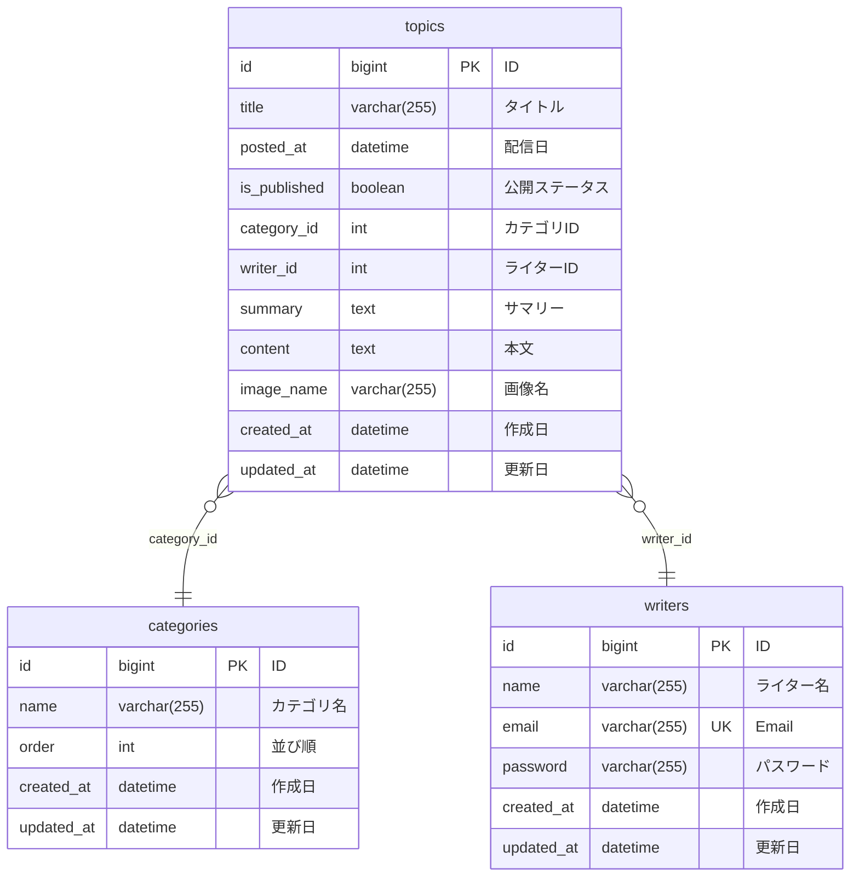

```mermaid
erDiagram
    topics {
        id bigint PK "ID"
        title varchar(255) "タイトル"
        posted_at datetime "配信日"
        is_published boolean "公開ステータス"
        category_id int "カテゴリID"
        writer_id int "ライターID"
        summary text "サマリー"
        content text "本文"
        image_name varchar(255) "画像名"
        created_at datetime "作成日"
        updated_at datetime "更新日"
    }
    categories {
        id bigint PK "ID"
        name varchar(255) "カテゴリ名"
        order int "並び順"
        created_at datetime "作成日"
        updated_at datetime "更新日"
    }
    writers {
        id bigint PK "ID"
        name varchar(255) "ライター名"
        email varchar(255) UK "Email"
        password varchar(255) "パスワード"
        created_at datetime "作成日"
        updated_at datetime "更新日"
    }
    topics }o--|| categories : "category_id"
    topics }o--|| writers : "writer_id"
```